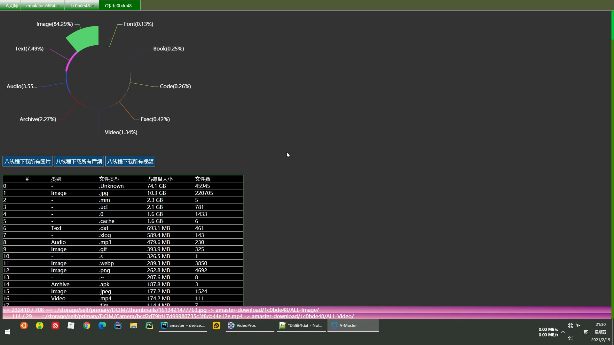
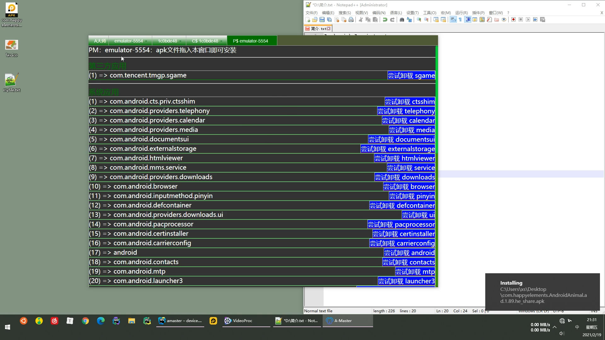

# amaster
安卓 电脑助手 ： 同步文件







# Rely 
+ Android Debug Bridge version 1.0.41 + 
+ perl (optional)
+ powershell

# develop 
```
npm install
echo electron.exe > node_modules\electron\path.txt
node node_modules\electron\install.js
npm start
```


# todo
- [ ]  编辑
- [x] 类型统计
- [x] 图片扫描并下载
- [ ] 图片预览
- [x] 多标签页资源管理器
- [ ] 文件夹大小
- [x] 右键文件夹
- [x] 应用管理
- [ ] 小米便签

